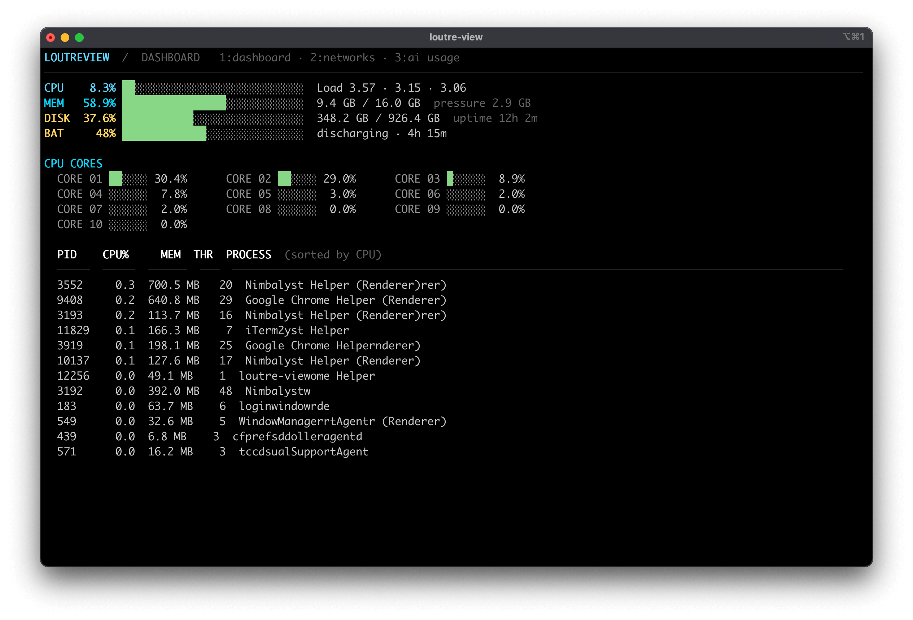

<p align="center">
  
</p>

<h1 align="center">LoutreView</h1>

<p align="center">A fast, native macOS terminal monitor.</p>

`loutre-view` is a fast, native macOS terminal monitor written in C. Its live dashboard includes color-coded usage bars, CPU and memory signal traces, load averages, memory pressure, disk use, battery status on portable Macs, uptime, and active processes. It calls macOS system APIs directly—there is no Node, Python, package manager, or runtime dependency.



## Requirements

- macOS
- Xcode Command Line Tools (`xcode-select --install`)

`loutre-view` uses macOS system frameworks directly, so it does not need Node,
Python, Homebrew, or another package manager.

## Install the latest release

On supported macOS machines, install the prebuilt CLI with:

```sh
curl -fsSL https://loutreview.com/install.sh | sh
```

This installs the binary to `~/.local/bin/loutre-view` and verifies the
download against the release checksum. To install a specific release, set
`LOUTREVIEW_VERSION`, for example `LOUTREVIEW_VERSION=v1.0.0`.

## Build from this project

Clone the repository, enter its directory, and compile the executable:

```sh
git clone <repository-url>
cd loutre-view
make
```

The compiled program is `./loutre-view`. Re-run `make` after changing
`loutre-view.c`.

## Run from the project

```sh
./loutre-view
```

The interactive dashboard refreshes every second. Press `1` for the dashboard,
`2` or `n` for network statistics, and `Tab` to switch between views. Press
`Ctrl-C` to exit.

## Install as a command

### For your user account

Install to `~/.local/bin` without `sudo`:

```sh
mkdir -p ~/.local/bin
install -m 755 loutre-view ~/.local/bin/loutre-view
```

Make sure `~/.local/bin` is in your `PATH`, then open a new terminal (or
reload your shell configuration) and run:

```sh
loutre-view
```

For zsh, add this line to `~/.zshrc` if the directory is not already in your
`PATH`:

```sh
export PATH="$HOME/.local/bin:$PATH"
```

### System-wide

To make the command available to every user on the Mac:

```sh
sudo install -m 755 loutre-view /usr/local/bin/loutre-view
loutre-view
```

Run `make` before either installation command. To update an existing
installation, rebuild and run the same `install` command again.

## Usage

```text
loutre-view [options]
```

Useful examples:

```sh
./loutre-view --once                 # one readable report
./loutre-view --json                 # one machine-readable report
./loutre-view --sort mem --limit 25  # biggest memory users
./loutre-view --interval 500         # refresh twice per second
./loutre-view --compact              # dense dashboard for any terminal width
./loutre-view --no-color             # plain output for any terminal
loutre-view startup --no-color       # inspect launch agents, daemons, and login items
loutre-view startup --json           # machine-readable startup inventory
loutre-view startup --once           # static one-shot startup report
```

Options:

| Option | Description |
| --- | --- |
| `-i`, `--interval MS` | Refresh interval in milliseconds; minimum `250`, default `1000`. |
| `-n`, `--limit COUNT` | Number of processes to show; default `12`. |
| `-s`, `--sort FIELD` | Sort processes by `cpu`, `mem`, `pid`, or `name`; default `cpu`. |
| `--compact` | Use a dense dashboard without usage bars or per-core meters. |
| `--once` | Print one text report and exit. |
| `--json` | Print one JSON report and exit; useful in scripts. |
| `--no-color` | Disable ANSI color sequences. |
| `-h`, `--help` | Show command help. |
| `-v`, `--version` | Show the installed version. |

`--json` automatically enables `--once`. In the interactive dashboard, color
is also disabled when output is redirected or the `NO_COLOR` environment
variable is set. `--compact` is always opt-in; the full dashboard remains the
default. On wide, short terminals, the full dashboard places top processes
beside the CPU-core grid and limits that list to the available height.

The `startup` command lists configured launch agents, launch daemons, and
session login items. It reports whether each item is running, its live CPU and
memory cost when a process can be matched, the last observed start time, path,
and owner. Missing executable paths and configured-but-inactive entries are
shown explicitly, including last observed start time; use `--once` for a
static report or `--json` for automation.

The interactive Networks view shows each interface's status, current receive
and transmit rate, and cumulative receive/transmit totals.
