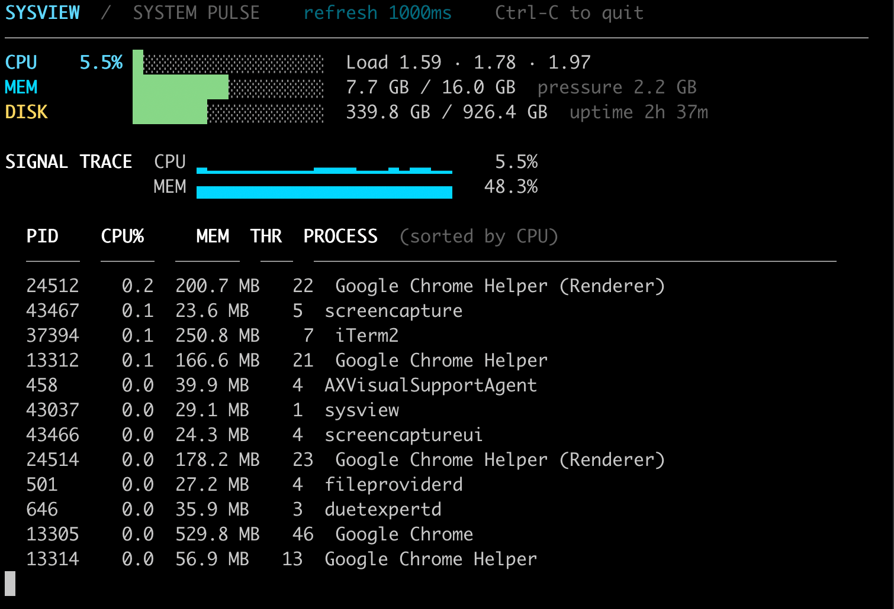

# sysview

`sysview` is a fast, native macOS terminal monitor written in C. Its live dashboard includes color-coded usage bars, CPU and memory signal traces, load averages, memory pressure, disk use, uptime, and active processes. It calls macOS system APIs directly—there is no Node, Python, package manager, or runtime dependency.



## Build

```sh
make
```

## Run

```sh
./sysview
```

## Install as a command

```sh
sudo install -m 755 sysview /usr/local/bin/sysview
sysview
```

Useful modes:

```sh
./sysview --once                 # one readable report
./sysview --json                 # one machine-readable report
./sysview --sort mem --limit 25  # biggest memory users
./sysview --interval 500         # refresh twice per second
./sysview --no-color             # plain output for any terminal
```

Press `Ctrl-C` to leave the live monitor. Run `./sysview --help` for all flags.

## Requirements

- macOS
- Xcode Command Line Tools (`xcode-select --install`)
